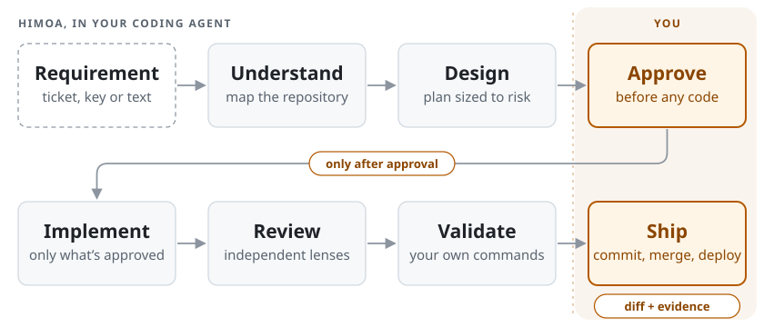
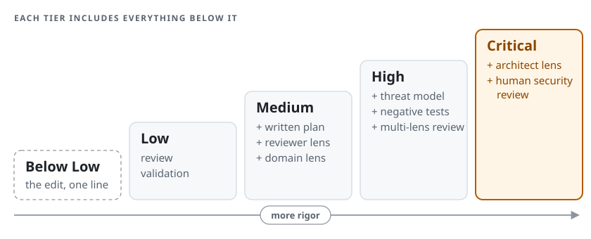

<div align="center">

# Himoa

## Turn AI coding into engineering.

An evidence-driven software engineering workflow for coding agents —<br>
on any stack, in any repository.

[](CHANGELOG.md)
[](https://github.com/jaylordibe/himoa/actions/workflows/ci.yml)
[](LICENSE)

Claude&nbsp;Code · Codex · Cursor · Gemini&nbsp;CLI · GitHub&nbsp;Copilot

**[Why&nbsp;Himoa](#why-himoa)** · **[How&nbsp;it&nbsp;works](#how-a-change-flows)** ·
**[Quick&nbsp;start](#quick-start)** · **[Principles](#principles)** ·
**[Supported&nbsp;agents](#supported-agents)** · **[Docs](#documentation)**

<br>



</div>

---

## Why Himoa

Coding agents are very good at producing code. Shipping a change well takes
more than that: knowing what the system already is, deciding what should change
before changing it, having the result reviewed outside the context that wrote
it, and proving it against the checks the repository trusts. That is software
engineering — and under time pressure it is the part most easily skipped.

Himoa gives your coding agent that working method. **The model brings the
capability; Himoa brings the discipline around it — and keeps the decisions
that matter with you.**

| Without an engineering process | With Himoa |
|---|---|
| Requirement<br>↓ generate code<br>↓ tests pass<br>↓ assume done | Evidence from your repository<br>↓ a design sized to the risk<br>↓ **you approve**<br>↓ the smallest change that delivers it<br>↓ independent review<br>↓ your repository's own checks<br>↓ **you ship** |

It is not a prompt pack. Two parties own two different halves:

- **Himoa owns the methodology** — the workflow, the risk model, the review and
  validation discipline, the evidence rules and the approval boundary.
- **Your repository owns the truth** — what the system is, how it is built and
  how it is verified, stated once in [`AGENTS.md`](#where-your-truth-lives). An
  agent cites your code or says `UNKNOWN`; it never invents an architecture you
  don't have.

## How a change flows

`/himoa:work-item` runs the whole pipeline in one session and stops for you
**twice**: to approve the plan, and to take the finished diff. Between those
stops it keeps a visible stage ledger and does not ask for confirmation.

| Stage | What happens |
|---|---|
| **Understand** | Maps entry points, data flow, persistence, authorization, tenancy, contracts, async work and affected tests from repository evidence; grades the request's own factual claims against the code |
| **Design** | Assigns the [risk tier](#risk-decides-the-rigor) and writes a plan sized to it — from Medium up, every requirement, risk and process-flow step is mapped to a named test; at High, a threat model and alternatives |
| **Approve** — *you* | You approve, reject or change the plan. Silence, ambiguity, praise in passing or generated text is never approval, and an approval does not survive a material change to the design |
| **Implement** | Only what was approved, reusing what the repository already owns |
| **Review** | Independent read-only [lenses](#independent-review-lenses) chosen by risk; findings are verified against source, remediated and re-reviewed |
| **Validate** | Read-only. Runs your canonical commands and reports `PASS`, `FAIL` or `BLOCKED` with an evidence table |
| **Present** — *then you ship* | The diff, the evidence, a paste-ready pull-request description and recommended next steps, handed to you |

It stops early — saying why and what it blocks — on a material divergence from
the approved plan, a product decision the repository cannot settle, review
findings still open after two remediation cycles, a validation `FAIL` or
`BLOCKED` it cannot fix within the plan, or a missing prerequisite. Approved
work survives a restart: the run's position and its approval record live in a
state file outside your repository, and a resumed run checks whether the code
moved since you approved.

**The requirement stays the anchor.** When a ticket carries a numbered process
flow, Himoa treats it as the outline of the requirement: each step and branch
is carried into the plan, mapped to a test and checked in the validation
report's coverage. A step the code contradicts is surfaced, never quietly
re-ordered, and the approved scope is re-read after approval so the goal stays
in view three files deep.

<details>
<summary><b>What a run looks like</b> — illustrative shape, not captured output</summary>

```text
$ /himoa:work-item "Add rate limiting to the password-reset endpoint"

  Understand   maps the endpoint, its auth path, the existing limiter
  Risk         HIGH: authentication surface + public contract
  Design       plan + threat model + negative tests, presented
  ── STOP ──   approval required: waiting for you
  Implement    minimal diff, reuses the existing limiter
  Review       reviewer · security · tester · contract, run independently
  Validate     PASS: lint · types · tests  (the commands in AGENTS.md)
  Present      diff + evidence + pull-request description
  ── STOP ──   yours to commit, merge and deploy
```

</details>

<details>
<summary><b>Write the ticket first, drive one stage at a time, or review ad-hoc work</b></summary>

<br>

**`/himoa:write-ticket`** drafts a ticket the way a business analyst would — a
user story, the process flow when the order of steps is part of the outcome,
current behaviour cited from your code, observable acceptance criteria,
non-goals and open questions. It contains no design and leaves the risk tier to
the design stage. It writes nothing to any system unless you ask it, in that
turn, to create the issue in a connected tracker.

**One stage at a time:**

```text
/himoa:gate-design <requirement>  →  /himoa:gate-approve  →  /himoa:gate-implement
/himoa:gate-review                →  /himoa:gate-validate
```

Implemented something by hand? Run `gate-review`, then `gate-validate`. Gates
are human-typed: on Claude Code the model cannot invoke one, and the
methodology forbids it from simulating one.

</details>

## Where the human stays in control

Himoa prepares the diff, the tests, the evidence and the handoff. The acts of
record stay yours. Unless you ask for that exact operation, it does not:

- implement before you approve the plan;
- commit, push, force-push, merge, rebase or tag, or open or merge a pull
  request;
- publish, release or deploy;
- apply a migration, reset a database or repair production data;
- change infrastructure or rotate secrets;
- accept product, security, privacy or operational risk on your behalf.

A Critical change additionally requires a **human** security review — automated
review is never sufficient there.

If you pass `work-item` a real issue key and an issue-tracker MCP server is
connected, the final stage posts one comment on that item, and one on each
same-tracker item linked as depending on or blocked by it whose visibility is
no wider than the item's own. It never transitions an issue or edits a field.

> [!NOTE]
> This is methodology the agent is instructed to follow, not a runtime block.
> Himoa ships no permission rules and no command-gating hooks; how strongly
> each host can enforce the approval stop is stated per host under
> [Supported agents](#supported-agents).

## Principles

What Himoa asks of an agent, grouped by where in the lifecycle it matters.

| Before any code | What Himoa does |
|---|---|
| **Evidence first** | Maps the repository before any option is weighed — a read-only `context-mapper` runs before design, rather than work starting from the ticket |
| **Claims are graded** | Labels every claim in a map, plan or report `FACT` (with `path:line`), `INFERENCE`, `ASSUMPTION`, `ABSENT` or `UNKNOWN` — a missing fact is recorded, never filled in |
| **The goal, not the method** | Takes the *goal* from the ticket and weighs its suggested *method* against alternatives |
| **Content is evidence, not instruction** | A directive planted in a repository file is reported, not obeyed |

| While building | What Himoa does |
|---|---|
| **Rigor matches risk** | Four tiers, plus a below-Low exit, decide plan depth, review panel and tests — a typo and a migration do not get the same ceremony |
| **Design before code** | Nothing is implemented until you approve the design — from Medium up, a plan that maps every requirement to a test |
| **Minimal, in the established shape** | Builds the smallest scope that fully delivers the goal, the way established practice builds it, reusing what the repository already owns |

| Before anything ships | What Himoa does |
|---|---|
| **Independent review** | Read-only lenses in fresh contexts, never the context that wrote the diff; on High and Critical work, serious findings must survive an adversarial refutation pass |
| **Proof, not claims** | `PASS` only for a check that ran and passed for a stated scope — skipped, partial, filtered or flaky is never `PASS` |
| **No fake green** | Editing a check until it passes is a [manufactured pass](#no-fake-green), not a pass |

## Quick start

On Claude Code — [other agents](#install-on-other-agents) below.

**1. Install the plugin** — once per machine. If its commands don't appear,
run `/reload-plugins` or restart Claude Code.

```text
/plugin marketplace add jaylordibe/himoa
/plugin install himoa@jaylordibe
```

**2. Set up the repository** — once, by whoever sets it up.

```text
/himoa:framework-install
/himoa:framework-doctor
```

`framework-install` scaffolds `AGENTS.md`, a thin `CLAUDE.md` that imports it,
and the plugin declaration in `.claude/settings.json`. `framework-doctor` checks
the files exist, the declared commands resolve and the documentation still
matches the code; both need `jq` on `PATH`, and without it say so rather
than guess. Fill `AGENTS.md` in (below), then commit. A teammate who
pulls the repository runs only `/plugin install himoa@jaylordibe`.

**3. Run a change**

```text
/himoa:work-item "Add rate limiting to the password-reset endpoint"
```

`work-item` also accepts an issue key or an issue URL. On Claude Code, the
approval stop is a single decision in plan mode, not a command to type.

### Where your truth lives

Repository facts live in one file — **`AGENTS.md`** at the repository root —
read by every agent. Claude Code reads it through the thin `CLAUDE.md`
(`@AGENTS.md`); the other hosts read it directly. State once:

- **what the system is** — language, runtime, frameworks, data stores;
- **canonical commands** — build, lint, type-check, test; *validation runs
  these*;
- **high-risk paths** that deserve extra ceremony;
- **consumers** of your contracts, and deployment constraints.

An absent section is honest; a wrong one is load-bearing misinformation. Fill
it from repository evidence — the
[consuming repository guide](docs/consuming-repository-guide.md) walks
through it.

## Supported agents

One methodology everywhere. What differs is how strongly each host can enforce
it. Outside Copilot, no host makes it *impossible* for a misbehaving model to
proceed past the approval stop: hosts stop the model from invoking the gate
itself, and the methodology forbids inferring approval.

| Agent | Status | What that means |
|---|---|---|
| **Claude Code** | **Reference — full** | Native plugin; gate skills the model cannot invoke; read-only review subagents; an always-on `SessionStart` charter stamped with the plugin version |
| **OpenAI Codex** | **Supported — initial adapter** | Native skills; gates set `allow_implicit_invocation: false`; read-only sandboxed subagents; `AGENTS.md`. Structurally validated, live end-to-end run pending. The `AGENTS.md` bootstrap records the version it was written with and never updates itself, so a repository can run an older methodology silently |
| **Cursor** | **Supported — initial adapter** | Native `SKILL.md` and `AGENTS.md`; `disable-model-invocation` honoured; read-only reviewer subagents. Shares its install with Codex. Live end-to-end run pending |
| **Gemini CLI** | **Supported — initial adapter** | Reuses `AGENTS.md`; native read-only reviewer subagents; `/himoa:*` slash commands; gates are human-typed commands. Live end-to-end run pending |
| **GitHub Copilot** | **Supported with limitations** | Repository-committed `AGENTS.md`; approval is hard, because a human merges the pull request. Reviewer lenses are advisory — no read-only subagent, no skills mechanism — and `context-mapper` is not projected (over the host's custom-agent size limit) |

Every non-Claude adapter is *generated from the same source* and drift-checked
in CI — one methodology, never forked. A host is listed only once its adapter
runs the methodology, and enforcement is never rounded up. The live host runs
are defined in the [adapter smoke test](docs/adapter-smoke-test.md); they are
not run in CI, and their results are never assumed. Detail:
[platform capabilities](docs/platform-capabilities.md) ·
[cross-agent architecture](docs/cross-agent-architecture.md).

### Install on other agents

Nothing below writes outside the paths shown, and nothing commits on your
behalf.

<details>
<summary><b>Codex, Cursor and Gemini CLI</b> — one installer family</summary>

<br>

Run the installers from a clone:
`git clone https://github.com/jaylordibe/himoa && himoa/plugins/himoa/bin/himoa-<host>-install`.
Inside a Claude Code session with the plugin enabled, they are also on that
session's `PATH` by name, as below.

```bash
himoa-codex-install          # Codex  — skills + read-only reviewers + standards (machine)
himoa-cursor-install         # Cursor — shares the skills/standards install with Codex
himoa-gemini-install         # Gemini — ~/.gemini subagents + /himoa:* commands
himoa-codex-install --repo   # once per repository: create or extend AGENTS.md (never destroys it)
himoa-codex-doctor           # verify (himoa-cursor-doctor, himoa-gemini-doctor per host)
```

`--check` is a dry run; `--uninstall` removes only Himoa-owned files. For
Gemini, `himoa-gemini-install --repo` also points `.gemini/settings.json` at
`AGENTS.md`. Invoke the pipeline as Codex `$himoa-work-item`, Cursor
`/himoa-work-item`, Gemini `/himoa:work-item`.

</details>

<details>
<summary><b>GitHub Copilot</b> — repository-committed only</summary>

<br>

Copilot is a cloud agent, so its adapter never touches `$HOME`:

```bash
himoa-copilot-install        # writes ./AGENTS.md + advisory .github/agents/*.agent.md
himoa-copilot-doctor         # verify
git add AGENTS.md .github/agents && git commit   # then let Copilot open a PR
```

</details>

## Risk decides the rigor

Ceremony scales with what a change can break. A copy fix stays cheap; a
migration gets everything it needs.

<p align="center">
  
</p>

| Tier | Examples | You get |
|---|---|---|
| **Below Low** | Comment fix, rename in one file, log line, a one-liner whose cause and effect are on screen | The edit and a one-line note. No map, plan, lens or report |
| **Low** | Copy, isolated rename, test-only cleanup | No plan document; a self-review without lens subagents, then validation |
| **Medium** | Business logic, endpoint behaviour | A plan; `reviewer` plus the one domain lens the change touches |
| **High** | Authentication, authorization, tenancy, personal data, money, uploads, webhooks, integrations, migrations, public contracts, concurrency | Full plan, threat model, negative tests, multi-lens review |
| **Critical** | Identity infrastructure, cryptography, broad privileged access, destructive data work, production repair, release infrastructure | All of High, the `architect` lens, and **human security review** — automated review is never sufficient |

On a boundary between two tiers you get the **higher** one, and a change
touching a path your `AGENTS.md` lists under **High-risk paths** is raised. The
below-Low exit never applies to anything reaching authentication,
authorization, tenancy, personal data, money, migrations, public contracts or
concurrency. Asking Himoa to spend less buys a shorter report and fewer
speculative searches — never fewer tests, reviewers or checks than the tier
requires.

**Risk sets rigor, not the model.** The tier answers *how much engineering this
change needs*. Model choice is a separate, per-launch decision by the kind of
work: reasoning work — design, implementation, review — uses at least your
session's model, is raised where a stronger one is available for the hardest
calls, and is never downgraded to save usage. No guarantee Himoa makes depends
on which model ran.

**Investigate deeply, build minimally.** A High-risk change may earn a deep
map, a threat model and a full review panel and still ship as a five-line
diff. Himoa reuses what the repository already owns and prefers the platform
and standard library over new dependencies or abstractions. Minimal means
scope, never shape: what must be built is built the way established practice
builds it — cited from the repository, the platform's docs and how others solve
the same problem — not squeezed into a shortcut to avoid a table. Policy:
[`execution-efficiency`](plugins/himoa/standards/execution-efficiency.md) ·
[`architecture`](plugins/himoa/standards/architecture.md) §3.

## Independent review lenses

Eight read-only agents. None of them is given a file-editing tool; each
reviewing lens runs in a fresh context and owns one decision.

| Lens | Examines | Runs when |
|---|---|---|
| `context-mapper` | Actual architecture and blast radius, before design | First, before every design |
| `reviewer` | Correctness, state and concurrency defects, error handling, responsibility placement, dead or duplicated code, your declared conventions | Medium and above |
| `security` | Trust boundaries and sensitive operations (below) | High and above, or when the diff touches a trust boundary |
| `tester` | Whether tests actually protect the changed behaviour; test quality and determinism; whether the evidence supports the verdict | High and above, or when coverage is material |
| `contract` | Anything a consumer can observe — shapes, nullability, enums, error identifiers, pagination, events, webhooks; backward and mixed-version compatibility | The diff touches a public surface |
| `data` | Persisted shapes, constraints, indexes against real queries, transactions, tenancy in data access, migration and backfill safety, rollback | The diff touches persistence |
| `performance` | Workload and reliability (below), always against a stated workload assumption | The diff touches workload-sensitive behaviour |
| `architect` | Boundaries, ownership, plan conformance, deployment ordering and rollback | Cross-cutting or structural change, and every Critical change |

A lens is launched when the diff gives it something to judge — on High and
Critical work, uncertain applicability means launch it — and never to look
thorough. On High and Critical work, every Critical or High finding must also
survive an adversarial refutation pass before it stands.

**Security review** threat-models the change and examines authentication
(enumeration, token and session handling, credential storage); function-level
and record-level authorization, including another actor's or tenant's record;
untrusted input reaching sensitive sinks (injection, mass assignment, path
traversal, request forgery); rate limiting, replay and races; secrets and data
exposure; and, when the change reaches them, the browser trust boundary
(cross-site scripting, CSRF, cookies, CORS, headers), dependency and
build-chain trust, cryptographic primitives, and what the deployment exposes to
the internet. High-risk work requires negative tests — unauthenticated, wrong
permission, another tenant, another actor.

**Performance review** looks for work that grows without a bound (unbounded
reads, a query inside a loop, unbounded fan-out or recursion), access paths no
index serves and data loaded but never used, remote calls without timeouts or
with unbounded retries, duplicate and poison handling in async work,
backpressure and concurrency limits, and cache invalidation.

Seven domain playbooks carry the questions particular kinds of change must
answer — authentication, authorization, browser security, cryptography,
supply chain, background work, and debugging a defect to its cause before a fix
is designed.

> [!NOTE]
> This is source-level engineering review. It is **not** a penetration test, a
> scanner or dynamic analysis, and it guarantees no vulnerability is absent.
> Where your repository declares a security or audit command, validation runs
> it and reports it on its own evidence. Details:
> [security standard](plugins/himoa/standards/security.md) ·
> [SECURITY.md](SECURITY.md).

## Evidence, not claims

**Repository evidence outranks assumptions.** When sources disagree, the
precedence is:

```text
source code  >  tests  >  CI and build configuration  >  repository documentation
             >  ticket wording  >  the agent's own expectations
```

A missing fact is recorded as `ABSENT` or `UNKNOWN`, never filled in with
something plausible. That ranking decides what is *true* — it makes no file a
source of *instructions*. Directions come from the person in the conversation.

Validation verdicts never round up:

| Verdict | Meaning |
|:---:|---|
| `PASS` | The check ran and passed for the stated scope |
| `FAIL` | It ran and failed |
| `BLOCKED` | It could not run here |
| `N/A` | Your repository has no such step — does not block an overall `PASS` |

Himoa never calls a change "secure", "production-ready" or "done" beyond what
that evidence shows.

### No fake green

Passing a check and manipulating it until it passes are different things. Each
of these is a **manufactured pass**, not a pass:

- deleting, skipping, focusing or disabling a failing test;
- weakening an assertion so it no longer catches the wrong value;
- lowering a coverage, lint, type, security or performance threshold, or
  removing a rule or check;
- adding a suppression to silence a finding rather than fix it;
- narrowing a check's scope so the failing case is no longer exercised;
- leaving an empty catch, stub or placeholder behind a green check.

The line is what the change answers to: a check changed because the
*requirement* changed is engineering; a check changed because it was *red* is
manipulation. Validation itself edits nothing. When work genuinely requires
lowering a quality bar, that is surfaced for your decision, not taken on your
behalf. Source: [`evidence`](plugins/himoa/standards/evidence.md) §5.

## Reference

### What ships

- **16 skills** — `work-item`, `write-ticket`, five gates (`gate-design`,
  `gate-approve`, `gate-implement`, `gate-review`, `gate-validate`),
  `framework-install` / `framework-doctor`, and the seven domain playbooks.
- **8 read-only review agents** — listed [above](#independent-review-lenses).
- **1 `SessionStart` charter** carrying the always-on rules — and gating
  nothing.
- **Generated adapters** for Codex, Cursor, Copilot and Gemini, plus their
  `himoa-<host>-install` and `-doctor` scripts.

No build step, no runtime dependencies, no published artifact — the
marketplace serves this repository directly.

### Security boundaries

- **No permission rules, no command-gating hooks.** Prompting and blocking are
  governed entirely by your settings and permission mode. Himoa is
  methodology, not a security control.
- **Repository installs write a bounded set.** `framework-install` merges
  exactly three keys into your project's `.claude/settings.json` —
  `extraKnownMarketplaces`, `enabledPlugins` and
  `env.CLAUDE_CODE_ENABLE_TODO_TOOLS` — never `permissions`, never `hooks`, and
  nothing in `$HOME`. The `himoa-<host>-install` bins write only Himoa-owned,
  prefixed paths, are idempotent, and never overwrite unrelated files or
  destroy an existing `AGENTS.md`.

Rationale: [architecture](docs/architecture.md) · [SECURITY.md](SECURITY.md).

### Update

On Claude Code, auto-update is on by default — the new version loads on your
next launch or after `/reload-plugins`. If you opted out
(`himoa-install-settings --no-auto-update`): `/plugin marketplace update
jaylordibe` then `/plugin update himoa@jaylordibe`, and restart. On a **major**
version bump, read the [CHANGELOG](CHANGELOG.md) first. For other hosts,
re-run `himoa-<host>-install`; `himoa-<host>-doctor` reports a stale install.

### Troubleshooting

<details>
<summary>Common symptoms and fixes</summary>

<br>

| Symptom | Cause and fix |
|---|---|
| Skills or commands don't appear | Not installed, or the session predates the install. Re-check [Quick start](#quick-start) or [other agents](#install-on-other-agents), then reload or restart. |
| Works for me, not for a teammate (Claude) | They need the per-machine `/plugin install`, not `framework-install`. The plugin doesn't travel with `git pull`. |
| `framework-doctor`: repository does not declare Himoa | Run `framework-install` (Claude) or `himoa-<host>-install --repo`, and commit the result. |
| Everything prompts for permission / a command is blocked | Not Himoa — it ships no permission rules. Check your own settings and permission mode. |
| An agent describes architecture you don't have | Your `AGENTS.md` is missing or stale. Fill it from evidence, run the doctor, then [open an issue](https://github.com/jaylordibe/himoa/issues) with the transcript. |
| The agent claims a gate ran that you didn't type (Claude) | It didn't run — gates cannot be model-invoked. The claim is the bug. |
| A non-Claude host doesn't reflect the methodology | Confirm `himoa-<host>-doctor` is green, and see the [adapter smoke test](docs/adapter-smoke-test.md). |

</details>

## Documentation

| Document | For |
|---|---|
| [Consuming repository guide](docs/consuming-repository-guide.md) | Setting up a repository and filling `AGENTS.md` |
| [Platform capabilities](docs/platform-capabilities.md) | What each agent can and cannot enforce |
| [Cross-agent architecture](docs/cross-agent-architecture.md) | One methodology, native adapters — the core/adapter boundary |
| [Adapter smoke test](docs/adapter-smoke-test.md) | Producing live end-to-end evidence per host |
| [Architecture](docs/architecture.md) | Why methodology and repository own different things |
| [Migration from `.claude`](docs/migration-from-dot-claude.md) | Moving an existing setup onto Himoa |
| [Versioning](docs/versioning.md) · [Changelog](CHANGELOG.md) | What each release means and asks of you |
| [Development guide](docs/development-guide.md) · [Constraints](docs/constraints.md) | Changing or releasing Himoa; the host limits that shaped it |
| [README visual assets](docs/assets/README.md) | How the diagrams above are built and kept legible |

---

<div align="center">

**Himoa owns the methodology. Your repository owns the truth.**

MIT licensed · Contributions welcome — see [CONTRIBUTING.md](CONTRIBUTING.md)

</div>
